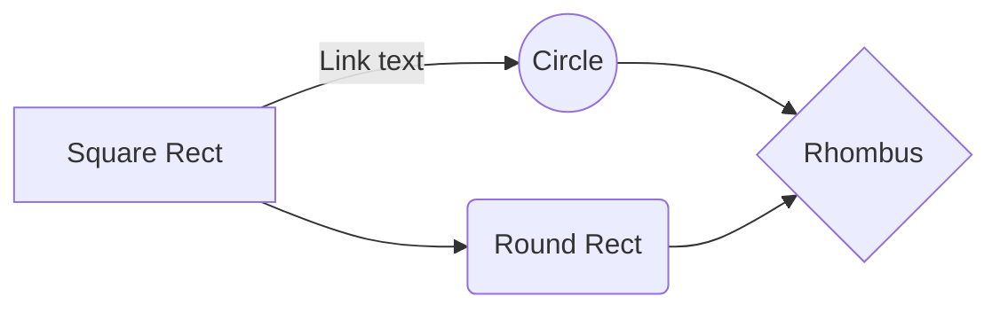

22:15 11 dec
This is my file.
I am typing this in line 2.

But I leave a line and type this on line 3.

\# Why should this be a header?


# This is my header.
## This is the sub-header.
### This is the next level sub-header.
#### This is the next level sub-header.
##### This is the next level sub-header.
###### This is the next level sub-header.
####### This is not working as a header.

I want to *emphasise* something.

 markdown in Atom
 markdown in atom

How about _now_?

How about `now`?

This is in **Atom**.

This is in __Atom__.

This is ***my*** Markdown file in Atom.

This is ___mine___.

Suppose you want to show `markdown`.

    What? (4 spaces before the word) black box

```
Block of formatted code (new line, black box and block code)
```


~~I don't like this sentence.~~

1. Apples
2. Oranges

- Apples
- Oranges

* Apples
* Oranges
  * Mandarin
    * Blood
* Plums

1. Indenting lists
    1. ordered
    - make sublists
      - some more
1. What's all this?
2.


  [Spoken Tutorial](https://spoken-tutorial.org) can be your source for A-V tutorials.
vi06an@gmail.com

This is a reference [link] [1].
[1]: https://spoken-tutorial.org


 "Spoken Tutorial" (https://spoken-tutorial.org)

colon optional but alignment


AQI in Mumbai suburbs on Days 1 and 2 after Diwali
| Suburb | Day 1 | Day 2 |  
|--- | :---: | ---: |   
| Andheri | 452 | 343 |  
| Bhandup | 73 | 90 |   
| BKC | 252 | 155 |


    Is this a blockquote?

`Is this a blockquote?`

  > This is a blockquote.
  >
  This is a blockquote.

* [ ] Unchecked option
* [x] Checked option


- - -
* * *
_ _ _ ________
Horizontal rule

$$ a^2 + \dfrac{5}{\sqrt{4x}} $$

$\Gamma(n) = (n-1)!\quad\forall n\in\mathbb N$ is via the Euler integral

$$ \Gamma(z) = \int_o^\infty t^{z-1}e^{-t}dt\, $$

$$ x = \dfrac{-b \pm \sqrt{b^2 - 4ac}}{2a} $$

$$ z = x + y $$

$$ a^2 + b^2 = c^2 $$

$$ \begin{vmatrix}a & b\\
c & d
\end{vmatrix}=ad-bc $$

# L1 abc
## L2 abc
## L2 abc
# L1
## L2
## L2
### L3
#### L4
## L2

Why can't I stage and commit this file?
Now?



